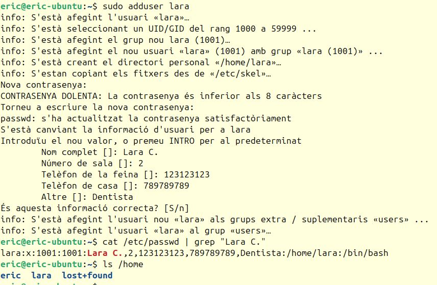
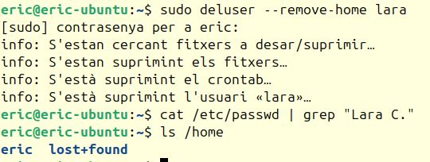
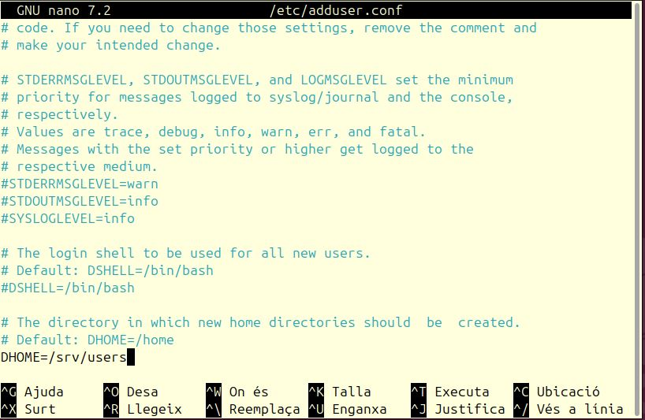
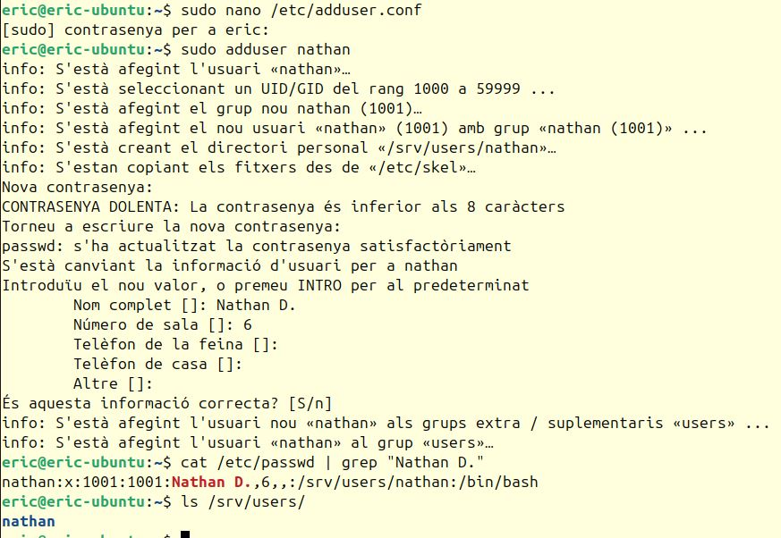

## Exercici 1 - Particions i Dual Boot
A la mateixa màquina virtual, realitza una instal·lació d'Ubuntu amb mode BIOS i de Windows amb UEFI definint les particions manualment per a cada sistema operatiu. A Ubuntu defineix una partició per a l'arrel (/), una per a les dades personals dels usuaris (/home), una per a la memòria swap i una per a l'arrancada EFI. És possible que es creï una partició d'1MB automàticament. A Windows defineix on vols instal·lar Windows, és possible que es creïn diverses particions.

Exercici resolt a [dualboot-u+x.md](./dualboot-u+w.md).

## Exercici 2 - Gestors de paquets alternatius
Instal·la, executa i desinstal·la un paquet segons els següents mètodes:

### Gestors de paquets I: apt
Instal·la el paquet btop utilitzant la comanda apt i comprova que funcioni.

### Gestors de paquets II: dpkg
Descarrega el fitxer *fastfetch-linux-amd64.deb* des del seu [repositori oficial](https://github.com/fastfetch-cli/fastfetch/releases/tag/2.60.0), instal·la-ho amb la comanda dpkg i comprova que funcioni.

### Gestors de paquets III: aptitude
Navega a través del menú d'aptitude, instal·la el paquet *brutalchess* i comprova que funcioni. Es troba a la categoria *Paquets no instal·lats* -> *games* -> *universe*.

Recorda que per a sel·leccionar un paquet s'ha de prémer '+'. Una vegada s'ha sel·leccionat, es pot instal·lar a través de prémer 'g'.

_Informació sobre ús d'aptitude_: https://wiki.debian.org/Aptitude#Interactive_Use

### Gestors de paquets IV: repositoris
Descarrega el fitxer *google-chrome-stable_current_amd64.deb* des de la [pàgina oficial](https://www.google.com/intl/ca_ES/chrome/), instal·la-ho amb la comanda que vulguis, verifica que s'hagi afegit el respositori de google-chrome, és a dir, que s'hagi creat el fitxer */etc/apt/sources.list.d/google-chrome.list* i comprova que puguis utilitzar l'aplicació.

## Exercici 3 - Creació d'usuaris i ubicació del directori personal
Completa les següents tasques sobre creació d'usuaris:
1. Crea un usuari amb la comanda adduser i comprova que s'hagi creat el seu directori personal consultant el fitxer /etc/passwd i el directori /home.

 _Creació de l'usuari lara i comprovació mitjançant /etc/passwd i /home_

2. Esborra l'usuari amb el paràmetre --remove-home. Comprova que s'hagi esborrat l'usuari a /etc/passwd i el seu directori a /home.

 _Esborrat de l'usuari lara i comprovació mitjançant /etc/passwd i /home_

3. Explora el fitxer /etc/adduser.conf i assigna /srv/users al paràmetre DHOME. Crea un nou usuari i comprova que s'hagi creat el seu directori personal a /srv/users consultant el fitxer /etc/passwd.

 _Assignació de /srv/users a DHOME_

 _Creació de l'usuari nathan i comprovació mitjançant /etc/passwd i /srv/users_

## Exercici 4 - Modificació del directori /etc/skel
Explora el directori /etc/skel i fes les següents tasques:
1. Editar /etc/skel/.profile per a afegir la benvinguda a l'usuari
2. Editar /etc/skel/.bashrc per a afegir un alias que faci 'apt update' quan s'escrigui 'aupdate'
3. Editar /etc/skel/.bash_logout per a afegir un missatge de comiat.

## Exercici 5 - Gestió d'usuaris, grups i permisos
Completa les següents tasques sobre gestió d'usuaris, grups i permisos:
1. Crea 1 grup (prototip) i 4 usuaris (u1, u2, u3 i u4). Comprova els membres del grup consultant el fitxer /etc/group.
2. Crea una carpeta (prototip) a /var.
3. Assigna u3 com a usuari propietari de la carpeta i prototip com a grup propietari de la carpeta. Comprova el resultat amb ls -l.
4. Elimina els permisos de lectura i execució a prototip a la  resta d'usuaris. Comprova el resultat amb ls -l.
5. Comprova que u3 pot crear arxius dins de prototip.
6. Comprova que u2 no pot crear arxius dins de prototip.